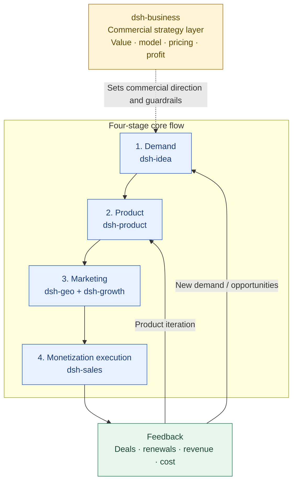

# dsh-idea

English | [中文](./README.zh.md)

`dsh-idea` 是一个面向外部机会、市场变化和真实需求发现的 DeepSeek Harness 插件包。

`dsh-idea` is a DeepSeek Harness bundle for evidence-backed external opportunity discovery and product discovery.

It turns “find an idea” into a repeatable operating loop:

> signal → problem → opportunity → candidate idea → smallest useful test

The package is external-first. It can scan user-selected public pages for bounded source snapshots, then normalize optional Markdown, CSV, TSV, JSON and JSONL research records, filter and rank pain-point signals, cluster them into opportunity themes, draft multiple solution directions and generate a falsifiable experiment plan.

## Plugin Positioning and Collaboration Navigation

`dsh-idea` is the opportunity-discovery layer in the six-plugin system. It turns external signals into testable opportunities and does not treat unvalidated ideas as product requirements.

- **Owns:** External market signals, real pain points, target users and contexts, opportunity themes, candidate directions and smallest falsifiable experiments.
- **Inputs:** User-selected public pages, community/competitor/review evidence and locally imported research records.
- **Outputs:** `idea_review`, Opportunity Solution Trees, candidate directions, interview guides and threshold-based experiment plans for [dsh-product](../dsh-product/README.md), with commercial viability reviewed by [dsh-business](../dsh-business/README.md).
- **Does not own:** Product delivery, commercial pricing, sales closing, growth analytics or SEO/GEO content execution. Popularity is not demand proof.

## Positioning Architecture: Commercial Strategy Layer + Four-Stage Core Flow

The six plugins work together to turn a real demand signal into a deliverable product, reach target customers through marketing, and use monetization results to drive product iteration or discover new opportunities.



This plugin owns the demand stage: establish who has what pain in which context, how they solve it today and why it matters now; then hand the opportunity to [dsh-product](../dsh-product/README.md) while [dsh-business](../dsh-business/README.md) reviews commercial value. New problems, unmet needs and user contexts found during monetization return here for further research.

## Plugin Navigation

| Plugin | Clear responsibility | Direct link |
| --- | --- | --- |
| dsh-idea | External opportunities, demand signals, candidate directions and smallest useful tests (this plugin) | [README](./README.md) |
| dsh-product | Product definition, POC/MVP, release gates and PMF | [README](../dsh-product/README.md) |
| dsh-business | Cross-cutting commercial strategy, value, pricing and profitability | [README](../dsh-business/README.md) |
| dsh-sales | Monetization execution: qualification, deal progression, closing, expansion and renewal | [README](../dsh-sales/README.md) |
| dsh-growth | Acquisition, activation, retention, revenue analysis and growth experiments | [README](../dsh-growth/README.md) |
| dsh-geo | SEO/GEO/AEO, content production and search/answer-engine discoverability | [README](../dsh-geo/README.md) |

## Recommended Handoffs

| Output from this plugin | Hand off to | Handoff question |
| --- | --- | --- |
| Opportunity themes, target users, contexts and pain evidence | [dsh-product](../dsh-product/README.md) | Can we build a smallest useful product and test the key assumptions? |
| Value, payment signals and competitive/substitute evidence | [dsh-business](../dsh-business/README.md) | Which model and pricing structure can be profitable? |
| Validated user language, problems and search signals | [dsh-geo](../dsh-geo/README.md) | Which content will help target users find and trust us? |
| Experiment results and new user feedback | Back to this plugin | Which opportunity, user or context needs more research? |

## What it does

- Scan public HTTP(S) pages from communities, issue trackers, reviews, trend pages, competitor pages or research reports without credentials.
- Run an onboarding/readiness check for an idea-discovery workspace and its external research evidence.
- Import optional structured or Markdown-based pain-point records without losing source lineage.
- Filter by keyword, target user, scene, source type, date, pain score and repeat count.
- Rank signals by latest, repeated, painful or verifiable.
- Build opportunity themes from user × scene groups instead of turning each complaint into a feature.
- Draft multiple solution lenses: automation, copilot, workflow, marketplace and education.
- Generate an experiment with audience, steps, evidence, thresholds, duration and decision rule.
- Keep facts, signals, inferences and validated findings separate.
- Generate source-specific research plans for Product Hunt, TrustMRR, Reddit, G2, GitHub, Google Trends and other external sources.
- Score evidence by behavior, workaround, cost, repetition, cross-source support, commercial signals and “why now”.
- Generate JTBD, The Mom Test, switching and critical-event interview guides.
- Convert an `idea_review` result into an Opportunity Solution Tree with multiple solutions and experiments.

The external opportunity radar is intentionally only a research entry point. It does not perform unrestricted crawling, claim that a hot topic proves demand, or replace customer discovery and validation.

## Included tools

| Tool | Purpose |
|---|---|
| `idea_external_scan` | Fetch bounded public URL snapshots and return external evidence limits |
| `idea_source_plan` | Recommend external sources, search recipes, evidence fields and platform biases for a topic |
| `idea_opportunity_radar` | Combine external source planning with optional user-provided public URL snapshots |
| `idea_onboarding` | Check workspace readiness, signal coverage, evidence gaps and the next discovery step |
| `idea_signal_import` | Normalize a local Markdown/CSV/TSV/JSON/JSONL source into signal cards |
| `idea_evidence_score` | Score signal evidence strength and demand stage without claiming demand proof |
| `idea_interview_guide` | Generate JTBD, Mom Test, switching or critical-event interview scripts |
| `idea_signal_filter` | Filter and rank signals with evidence quality attached |
| `idea_opportunity_map` | Cluster signals into opportunity themes with risks and workarounds |
| `idea_candidate_draft` | Draft multiple candidate directions from opportunity themes |
| `idea_experiment_plan` | Turn one candidate into a smallest useful validation experiment |
| `idea_review` | Run the complete signal → opportunity → candidate → experiment review |
| `idea_ost` | Turn an idea review into an Opportunity Solution Tree |
| `idea_report` | Render an `idea_review` result as a shareable Markdown report |

## Standard method

1. Define the external market, region, target user, desired outcome and constraints.
2. Scan or research multiple public sources with URL, date and evidence limits.
3. Extract behavior, workaround, cost and “why now” signals.
4. Filter a research view by topic, user, scene, source, time and evidence strength.
5. Cluster signals into opportunities and separate them from solutions.
6. Draft more than one solution direction.
7. Test the riskiest assumption with interviews, concierge service, prototype, landing page or preorder.
8. Decide whether to continue, adjust or pause based on explicit thresholds.

## Input example

```csv
problem,user,scene,source,sourceUrl,behavior,workaround,cost,painScore,repeatCount,capturedAt
每周手工整理报告,运营人员,内容运营,访谈,https://example.com/interview,复制多个表格再合并,Excel + 脚本,每周 4 小时,8,5,2026-08-20
```

## External boundary

External scanning is limited to user-selected public HTTP(S) URLs. The plugin does not use cookies, credentials, private accounts, unrestricted crawling, live posting or outreach. Local files under `defaultRoot` remain available as optional caches, exports and supplementary evidence.

## References

- `skills/idea-discovery/SKILL.md`: operating contract, method selector and output rules.
- `references/methods-and-resources.md`: method cards, signal library, pain-point radar and official resources.
- `assets/templates/`: copyable context, signal, opportunity and experiment templates.
- `docs/项目架构与使用指南.md`: architecture and tool workflow.

## License

MIT
