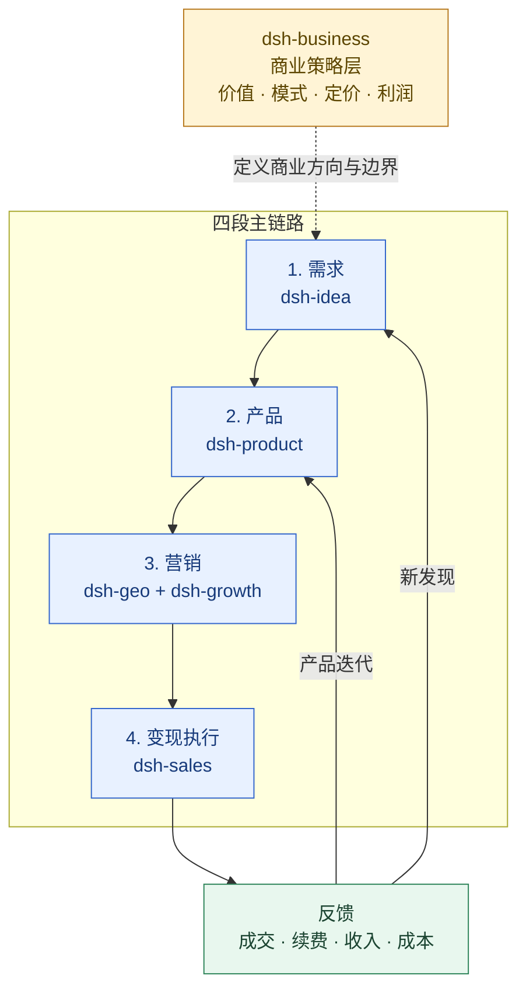

# 创意发现（dsh-idea）

中文 | [English](./README.md)

`dsh-idea` 是一个面向外部机会、市场变化和真实需求发现的 DeepSeek Harness 插件包。

六插件公开协作契约：[SUITE.md](https://github.com/winyh/dsh-business/blob/main/SUITE.md)。

它把“找 idea”变成一条可复用的工作流：

> 信号 → 问题 → 机会 → 候选 idea → 最小验证实验

插件采用 external-first 方式：优先扫描用户指定的公开网页和外部市场信号；本地 Markdown、CSV、TSV、JSON 和 JSONL 只是可选的缓存、导出和补充证据输入。

## 插件定位：需求发现层

`dsh-idea` 负责把外部信号整理成可验证的需求和机会，不把未经验证的想法直接当成产品需求。

- **主责：** 外部市场信号、真实痛点、目标用户与场景、机会主题、候选方案和最小可证伪实验。
- **输出：** 机会主题、目标用户、痛点证据、候选方向、访谈提纲和实验计划，交给 `dsh-product`；由 `dsh-business` 同步评估商业价值。

`idea_opportunity_handoff` 会把 `idea_review` 转成版本为 `1.0` 的 `opportunity-handoff`，保留来源、目标用户、场景、问题、替代方案、证据、最危险假设和验证实验。`partial` 交接表示证据仍有缺口，不是产品需求承诺。
- **边界：** 不负责产品交付、定价设计、销售成交、增长分析或 SEO/GEO 内容执行。

## 定位架构：商业策略层 + 四段主链路

## 插件导航

| 插件 | 分工 | 直接跳转 |
|---|---|---|
| `dsh-idea` | 外部机会、需求信号、候选方案和最小验证 | [README](./README.zh.md) |
| `dsh-product` | 产品定义、POC/MVP、发布门槛和 PMF | [README](../dsh-product/README.zh.md) |
| `dsh-business` | 横跨全链路的商业策略、价值、定价和盈利 | [README](../dsh-business/README.zh.md) |
| `dsh-sales` | 变现执行：资格判断、商机推进、成交、扩单和续约 | [README](../dsh-sales/README.zh.md) |
| `dsh-growth` | 获客、激活、留存、收入分析和增长实验 | [README](../dsh-growth/README.zh.md) |
| `dsh-geo` | SEO/GEO/AEO、内容生产和搜索/答案引擎可发现性 | [README](../dsh-geo/README.zh.md) |

## 工具

- `idea_onboarding`：检查研究工作区、信号覆盖和证据缺口。
- `idea_external_scan`：扫描用户指定的公开网页，返回带来源和限制说明的外部快照。
- `idea_source_plan`：根据主题推荐 Product Hunt、TrustMRR、Reddit、G2、GitHub、Google Trends 等外部资源、搜索词和证据字段。
- `idea_opportunity_radar`：生成外部机会雷达，并可读取用户指定的公开网页快照。
- `idea_signal_import`：把本地研究资料规范化成痛点卡片。
- `idea_evidence_score`：按行为、workaround、代价、重复、跨来源和商业信号评分，不把分数当作需求证明。
- `idea_interview_guide`：生成 JTBD、Mom Test、切换访谈和关键事件访谈提纲。
- `idea_signal_filter`：按关键词、用户、场景、来源、时间、痛苦程度和重复出现次数筛选。
- `idea_opportunity_map`：将信号聚类为机会主题，而不是直接生成功能。
- `idea_candidate_draft`：从机会主题生成多个候选解决方向。
- `idea_experiment_plan`：针对最危险假设生成最小验证实验。
- `idea_review`：运行完整的信号→机会→idea→实验复盘。
- `idea_ost`：把 `idea_review` 结果整理成“目标结果→机会→多种解法→假设→实验”的机会解法树。
- `idea_report`：把 `idea_review` 结果渲染成可分享的 Markdown 报告。

插件部分吸收了公开痛点检索产品的交互思路：关键词、多维筛选、排序、保存研究视图和导出；但不做无限制爬取，也不把“最热/最痛”当成需求证明。

## 相关内容

- `skills/idea-discovery/SKILL.md`：方法论、SOP、质量门和输出契约。
- `references/methods-and-resources.md`：主流方法、资源和痛点雷达参考。
- `assets/templates/`：研究上下文、痛点卡片、机会简报和实验卡片模板。
- `docs/项目架构与使用指南.md`：架构与使用说明。

## 许可证

MIT
